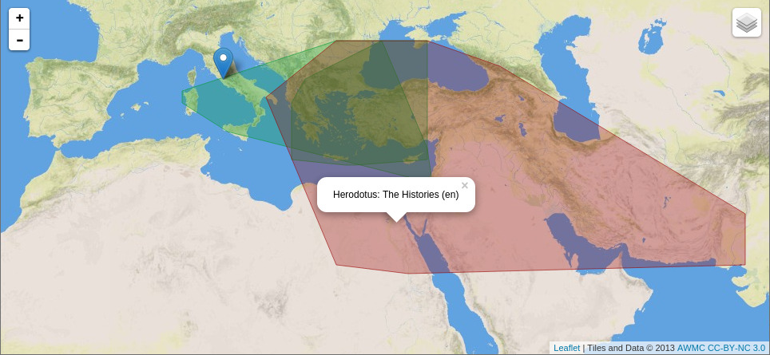
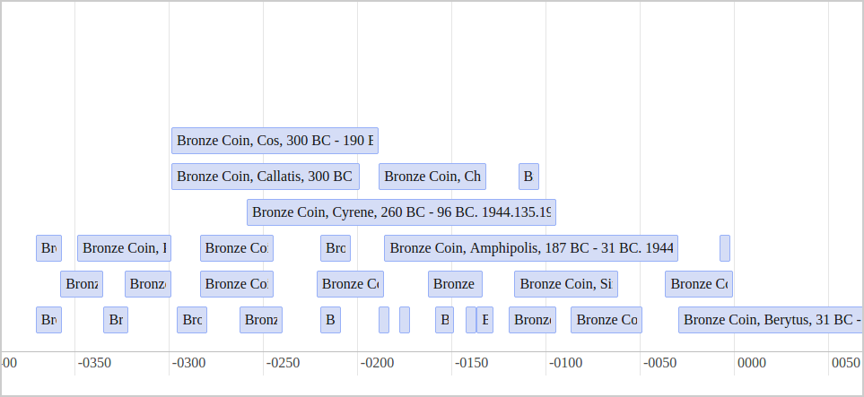
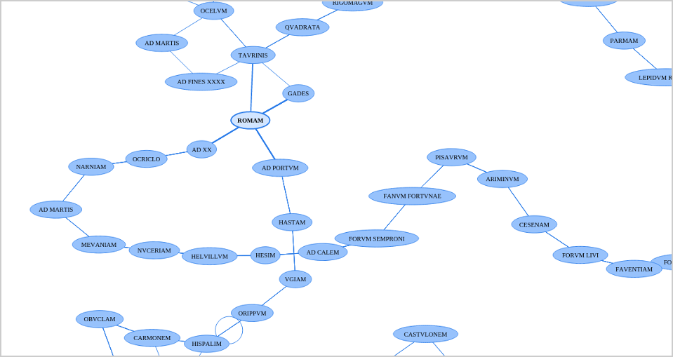

# Pelagios API Developer Examples

These examples illustrate how you can use the [Pelagios API](http://github.com/pelagios/pelagios-api-v3) 
in your own Web mashups and applications. The examples require knowledge of JavaScript, and it helps if you 
have used a Web mapping library before. But otherwise, things should Just Work.

## Running the Examples

If you have a GitHub account, clone this repository. Otherwise, 
[download the whole project as a Zip](https://github.com/pelagios/pelagios-api-tutorial/archive/master.zip),
and unpack at a convenient location. There are two examples in the project:

### Example 1: Mapping the Spatial Footprint of a Document

This example uses the [search functionality of the Pelagios API](https://github.com/pelagios/pelagios-api-v3/blob/master/README.md#searching-the-api)
to retrieve objects and map their geographical outlines on a map. Most objects on the Pelagios API have a "footprint" of just a single coordinate
(e.g. because they are archaeological items, coins, etc.). But the literary works from the [Pelagios 3 collection](http://pelagios.org/api-v3/pages/datasets/2a10228dff4c608b91a953efff8dafb3f5c433035b3f31e687eec0297d799824)
typically cover a larger area.

The example searches the API for the terms _'Homer'_ and _'Herodotus'_, grabs the search results' [convex hulls](http://en.wikipedia.org/wiki/Convex_hull)
from the JSON responses and overlays them on map in different colours in order to visualize their different spatial focus. The
example uses the [Leaflet](http://leafletjs.com) Web mapping library, along with suitable base layer maps developed by the
[Digital Atlas of the Roman Empire](http://imperium.ahlfeldt.se/) and the [Ancient World Mapping Center](http://awmc.unc.edu/wordpress/tiles/map-tile-information).

Open the file ``tutorial-map.html`` with your browser to run the example. The relevant code to look at & tweak
is in the file [tutorial-map.js](tutorial-map.js).

### Example 2: Placing Objects on a Timeline

The second example uses the API to fetch objects that match the search query _'bronze AND coin'_, and which are dated
between 700 BC and 800 AD. The objects' timestamps (either a single year or an interval) are then used to 
construct an interactive timeline, using the [vis.js](http://visjs.org/) visualization library.

Open the file ``tutorial-timeline.html`` with your browser to run the example. Relevant code is 
in the file [tutorial-timeline.js](tutorial-timeline.js).

## Example 3: 'Nearby Toponyms' in a Document

This examples retrieves the places mentioned in a single document, and constructs a graph from how the places
occur in the text (again using the [vis.js](http://visjs.org/) visualization library). Places are connected if
they appear adjacent in the text. This way, the graph shows their sequence, but also how more frequently referenced
places become more central in the network.

## What Next?

Some things you could do next:

1. Try playing around with the features of the Pelagios API. For example: try plotting the footprints 
of all datasets; improve map popups, so that they link back to the original source of the data; make use 
of the thumbnail URLs included with some of our objects; are there any other datasets you know of you
could mash up with Pelagios API?

2. Try different visualization approaches & tools. E.g.: how about visualizing search results in 
[GeoTemCo](https://github.com/stjaenicke/GeoTemCo)?

3. Come up with something cool? Have more ideas? [Let us know](http://twitter.com/pelagiosproject)!
